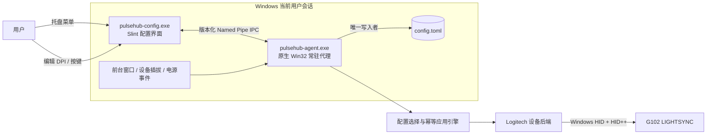

# PulseHub：目标与架构

> **Agent 导读：** 本文为根目录 [`AGENTS.md`](../../AGENTS.md) 提供架构依据。仅处理其定义的项目重构、新功能开发与 G102 之外物理设备适配；PulseHub 始终只适配 Windows。
> 本文由原 `docs/IMPLEMENTATION.md` 拆分，涵盖文档定位、目标边界与总体架构。

# PulseHub 实现文档

> 文档版本：0.1
> 更新日期：2026-07-21
> 目标平台：Windows 11 专业版 x64
> 文档状态：持续实现与实机验证

## 1. 文档定位

PulseHub 是一个使用 Rust 开发的轻量鼠标配置程序。第一阶段面向 Logitech G102 LIGHTSYNC，提供真实硬件 DPI 设置、鼠标按键分配，以及“办公”和“CS2”两套配置的自动切换。

当前代码已具备 Cargo Workspace、配置存储、IPC、前台环境监听、G102 HID++ 读写、Slint 配置窗口和系统托盘。`pulsehub-agent.exe` 是正式配置与 HID I/O 的唯一所有者；它通过受当前登录会话 TokenLogonSid 保护的 Windows Named Pipe 向 `pulsehub-config.exe` 提供快照和命令服务。G102 的完整应用会写入运行态 DPI、板载 profile、板载模式和固定关闭灯光，并在各设备操作路径中执行相应回读；这类行为只可在显式设备写入确认下运行。

本实现文档同时保留部分设计基线和待验收项。除明确以“当前代码”或“实机验证”标记的段落外，不得把其中的建议线程模型、性能指标或 Windows 通知方案当作已实现事实；后续开发以代码和根目录 `AGENTS.md` 为准。

本文使用以下状态词：

- **确定需求**：来自现有需求，可直接作为产品范围。
- **设计基线**：本文选定的实现方案，编码时默认遵循。
- **待验证**：必须通过 G102 LIGHTSYNC 实机或性能测试确认。
- **暂不实现**：不属于 MVP。

## 2. 目标与边界

### 2.1 功能目标

- 在 Windows 11 专业版上运行。
- 修改鼠标传感器的真实 DPI，不修改 Windows 指针速度来模拟 DPI。
- 为可编程鼠标按键设置一对一动作。
- 提供 `office` 与 `cs2` 两套配置。
- 当前台窗口属于 `cs2.exe` 时应用 CS2 配置；离开后恢复办公配置。
- 鼠标重连、Windows 睡眠恢复后，重新应用当前应生效的配置。
- 通过系统托盘打开配置界面、查看状态和退出常驻代理。

### 2.2 非功能目标

| 指标               | 当前代码事实 / 后续验收要求                                                                                                                   |
| ------------------ | --------------------------------------------------------------------------------------------------------------------------------------------- |
| 代理空闲 CPU、内存 | 尚未在本文记录可复现的 Release 基准；`0.1%` CPU 和 `15 MB` P95 仅为待验收目标。                                                               |
| 常驻组件           | agent 包含 IPC 监听线程、每连接会话线程、Slint 托盘线程及前台 hook 的专用线程；不得宣称稳定态仅有 `1–3` 个线程。                              |
| 定时工作           | 当前存在 1 秒托盘内存状态刷新、2 秒 DPI 健康回采，以及按需的一次性环境稳定窗口、5 秒应用冷却和重试计时。前台切换本身由 Windows 前台事件驱动。 |
| 托盘宿主           | 托盘由 `pulsehub-agent.exe` 中的 Slint `AppTray` 承载；它启动或等待 `pulsehub-config.exe` 退出。                                              |

还应记录 Private Bytes、Commit Size、句柄数、上下文切换和空闲唤醒频率，但首版不为它们预设未经验证的硬门槛。

### 2.3 暂不实现

- Windows 以外的平台。
- RGB 灯效、固件升级、报告率调整。
- 连发、压枪、多动作序列、延迟脚本等宏功能。
- 全局低级鼠标/键盘钩子和 `SendInput` 输入模拟。
- 内核驱动、Windows Service 或管理员权限常驻。
- 云同步、账号系统、遥测和自动更新。
- 与 G HUB 同时控制同一设备的仲裁。

## 3. 架构决策

### 3.1 总体架构

采用“轻量代理常驻、配置 GUI 按需运行”的双进程架构：

进程职责如下：

| 进程                  | 生命周期       | 职责                                                                           | 禁止事项                                                                                                                 |
| --------------------- | -------------- | ------------------------------------------------------------------------------ | ------------------------------------------------------------------------------------------------------------------------ |
| `pulsehub-agent.exe`  | 用户登录后常驻 | 系统前台监听、配置持久化、G102 连接与应用、IPC 服务，以及 Slint `AppTray` 托盘 | GUI 编辑器不能绕过其 HID/正式配置所有权；agent 当前依赖 Slint 并有受控周期任务                                           |
| `pulsehub-config.exe` | 用户按需启动   | 展示和编辑草稿、经 IPC 请求校验/提交/应用/退出；无托盘图标                     | 不直接打开 HID 设备；正常 GUI 保存经 agent 提交。仅 `--set-ui-language` 命令仍直接读写配置，属于需在未来收敛的历史例外。 |

这条进程边界保证代理是设备和持久化状态的唯一写入者。关闭主窗口只隐藏界面，托盘宿主和代理继续运行；选择“退出托盘”则请求代理应用安全退出配置并结束整个 PulseHub。安全退出配置固定为 DPI `1600`，六个物理按键全部恢复原生功能。

### 3.2 事件驱动

当前代理通过 `win_event_hook` 在专用线程监听 `EVENT_SYSTEM_FOREGROUND`，主协调路径以最长 250 ms 的接收超时处理前台事件、重试截止时间和命令队列；它不扫描 `cs2.exe` 或配置文件。另有 2 秒一次的 G102 DPI 健康回采，以及托盘线程 1 秒一次的内存语言状态刷新。因此“零固定周期轮询”不是当前实现事实。

当前已接入的事件来源为 `SetWinEventHook(EVENT_SYSTEM_FOREGROUND, ...)` 和 Named Pipe 请求；Slint `AppTray` 负责托盘交互。`RegisterDeviceNotificationW`、`WM_POWERBROADCAST`、`TaskbarCreated` 及隐藏 Win32 窗口不是当前 agent 的实现，仍是后续设计候选。前台 hook 回调只向容量为 1 的通道投递通知，实际前台进程查询与 HID I/O 在协调路径执行。

### 3.3 单一状态所有者

当前实现以 `run_agent` 所在线程作为协调路径：IPC 会话线程只读取 `RwLock<AgentSnapshot>` 或通过容量为 16 的 `sync_channel` 投递 `ApplyNow`、`Shutdown`、草稿校验/提交和模式切换命令；HID I/O 在协调路径串行执行。前台 hook 用容量为 1 的通道聚合事件。

当前快照由 `RwLock<AgentSnapshot>` 共享，而不是本文此前描述的 `Arc<AgentSnapshot>` 和 `invalidation_epoch` 模型。`AgentState`、连接代次、pending flags 和完整事务 token 仍是后续重构设计，不能当作现有行为依据。

已实现的不变量是：

1. agent 负责正常 GUI 路径的正式配置提交与全部 HID I/O；
2. IPC 客户端线程不直接访问 HID；
3. 完整 G102 应用在单一协调路径串行执行；
4. `commit_config` 成功只表示配置保存成功，`apply_now` 与环境切换才会触发设备应用；
5. G102 板载写入会先比较内容并在变更后回读。
