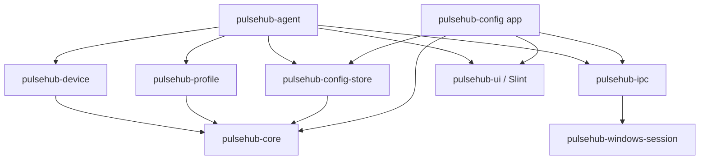

# PulseHub：工程结构与模块职责

> **Agent 导读：** 本文支撑根目录 [`AGENTS.md`](../../AGENTS.md) 的重构、新功能和设备适配工作。修改 crate、依赖或跨层契约前，先核对本文的依赖方向与职责边界。
> 涵盖 Cargo Workspace 结构及各 crate 的职责边界。

## 4. 建议工程结构

```text
PulseHub/
├─ Cargo.toml
├─ Cargo.lock
├─ rust-toolchain.toml
├─ apps/
│  ├─ pulsehub-agent/
│  │  ├─ Cargo.toml
│  │  └─ src/
│  └─ pulsehub-config/
│     ├─ Cargo.toml
│     ├─ build.rs
│     ├─ src/
│     └─ ui/
│        └─ app-window.slint
├─ crates/
│  ├─ pulsehub-config-store/    # 配置 schema、校验、备份与原子保存
│  ├─ pulsehub-core/            # 领域类型
│  ├─ pulsehub-device/          # HID 发现、HID++ 与 G102 适配
│  ├─ pulsehub-ipc/             # DTO、帧协议和 Windows Named Pipe
│  ├─ pulsehub-profile/         # 环境选择、去重与退避
│  ├─ pulsehub-ui/              # Slint 生成代码和公共 UI 集成
│  └─ pulsehub-windows-session/ # 当前 Windows 登录会话 TokenLogonSid
├─ tools/
│  └─ pulsehub-probe/      # 仅开发使用的设备探测工具
├─ assets/
│  ├─ icons/
│  └─ mouse-layouts/
├─ tests/
│  ├─ fixtures/
│  └─ hardware/
└─ docs/
   └─ IMPLEMENTATION.md
```

依赖方向必须保持单向：



`pulsehub-core` 不得依赖 Win32、Slint 或具体 Logitech 协议。GUI 也不得依赖 `pulsehub-device`。

## 5. 模块职责

### 5.1 `pulsehub-core`

定义与平台无关的领域模型：

```rust
pub enum Environment {
    Office,
    Cs2,
}

pub enum DpiValues {
    Range { min: u16, max: u16, step: u16 },
    Discrete(Vec<u16>),
}

pub struct DeviceCapabilities {
    pub device: DeviceIdentity,
    pub dpi_values: DpiValues,
    pub controls: Vec<ControlCapability>,
    pub runtime_dpi: bool,
    pub runtime_button_mapping: bool,
    pub onboard_profile_count: u8,
}

pub enum MappingMechanism {
    RuntimeRemap,
    OnboardCommit,
}

pub enum ButtonAction {
    LogicalControl(LogicalControlId),
    OnboardKeyboard(HidKey),
    OnboardConsumer(HidConsumerControl),
    Disabled,
}

pub struct ActionCapability {
    pub action: ButtonAction,
    pub mechanism: MappingMechanism,
}

pub struct Profile {
    pub id: ProfileId,
    pub dpi: u16,
    pub buttons: Vec<ButtonMapping>,
}
```

`ButtonAction` 只能表示一个离散动作，不包含事件序列、循环、等待时间或重复次数。`LogicalControl` 表示设备通过运行时重映射功能明确公布的目标 Control ID；`OnboardKeyboard` 和 `OnboardConsumer` 只有在板载配置功能确认支持后才会出现在能力列表。UI 必须同时检查动作和 `MappingMechanism`，不能因领域 enum 存在某个变体就假定当前设备支持它。

### 5.2 `pulsehub-device`

该 crate 包含三层：

1. `transport`：枚举并打开 HID collection，收发报告。
2. `hidpp`：HID++ 报文编解码、根功能发现、错误解析和请求关联。
3. `devices/logitech_g102`：G102/G203 型号能力适配和配置应用顺序。

对上层暴露同步接口，因为所有调用已经被串行化到设备工作线程：

```rust
pub trait MouseDevice: Send {
    fn identity(&self) -> &DeviceIdentity;
    fn capabilities(&self) -> &DeviceCapabilities;
    fn read_state(&mut self) -> Result<DeviceState, DeviceError>;
    fn apply_profile(&mut self, profile: &Profile)
        -> Result<ApplyReport, DeviceError>;
}
```

传输层再通过内部 trait 隔离：

```rust
pub trait HidTransport {
    fn transact(
        &mut self,
        request: &[u8],
        timeout: Duration,
    ) -> Result<Vec<u8>, TransportError>;
}
```

协议验证阶段可先使用 `hidapi` 的 Windows 后端；生产版本是否改为 `windows` crate 直接调用 SetupAPI/HID API，以实测资源、设备兼容和维护成本为准。上层不应感知这个选择。

### 5.3 `pulsehub-profile`

负责：

- 将前台进程解析为 `Environment`。
- 支持自动模式和手动覆盖模式。
- 对短时间内连续的前台事件做一次性合并，不使用周期轮询。
- 计算期望配置指纹。
- 判断是否需要应用配置。
- 维护设备连接、应用中、就绪和降级状态。

### 5.4 `pulsehub-config-store`

负责：

- `schema_version` 和数据迁移。
- 默认配置生成。
- 领域级校验。
- 同目录临时文件写入、落盘和原子替换。
- 主文件损坏时读取备份并报告恢复事件。

当前 `pulsehub-config-store` 使用 `serde`/`toml` 解析 schema v1；配置校验覆盖 Office/CS2/退出 profile、应用环境、进程规则、回报率、四个严格递增的 DPI 档位、重复物理控制、Keyboard HID Usage 与左/右主点击保护。默认 Office 与 CS2 DPI 都为 `1600`，回报率为 `1000 Hz`，按键保持原始鼠标动作；首次运行在 `%APPDATA%\\PulseHub\\config.toml` 创建配置。当前 G102 自动完整应用会比较板载内容后按需提交闪存，因此文档不得再宣称环境切换“不会反复提交按键闪存”。

### 5.5 `pulsehub-ipc`

负责：

- IPC 协议版本协商。
- 长度前缀帧的编解码。
- 请求、响应和事件 DTO。
- 最大消息长度和字段上限校验。
- Windows Named Pipe 客户端/服务端封装。
