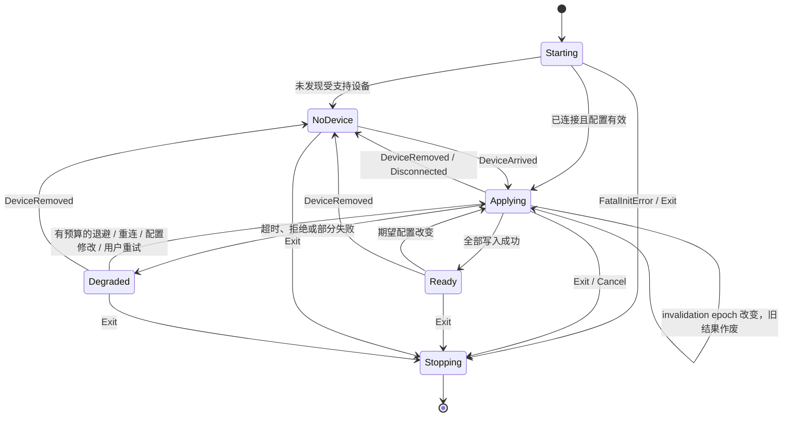
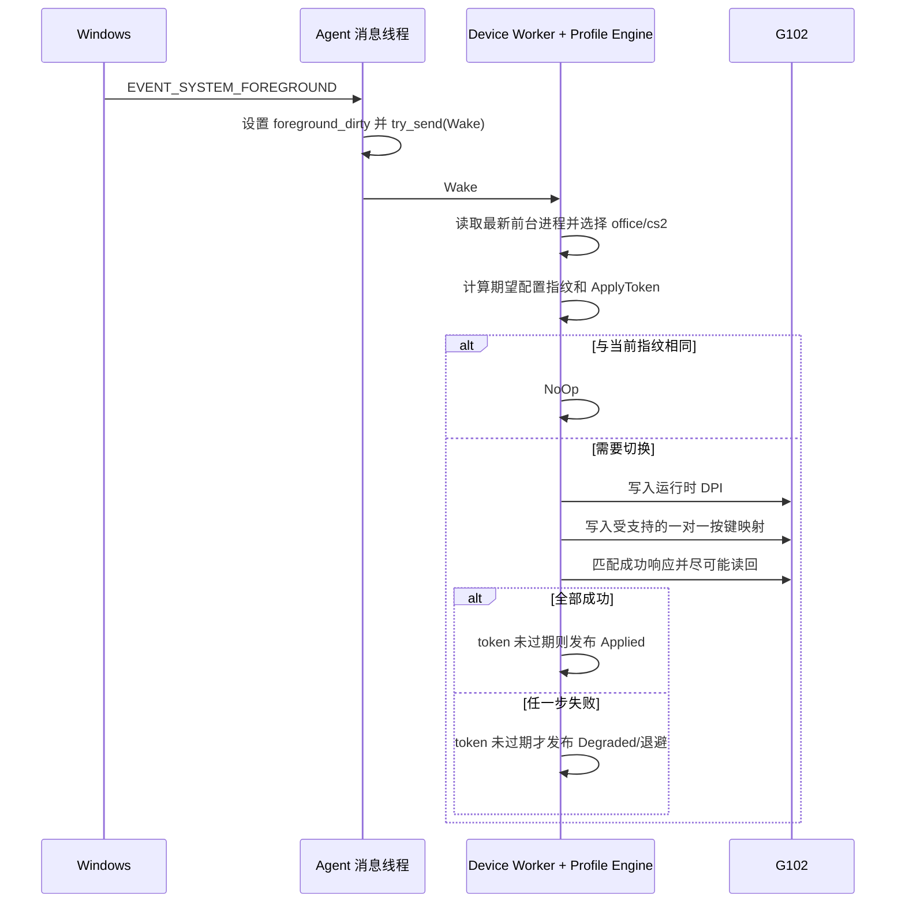

# PulseHub：代理与环境切换

> **Agent 导读：** 本文支撑根目录 [`AGENTS.md`](../../AGENTS.md) 的重构与 Windows 新功能开发。agent 是设备和正式配置的唯一写入者；不得为 GUI 或新设备适配绕过该边界。
> 涵盖代理线程模型、状态机、生命周期与 Office/CS2 自动切换。

## 6. 代理进程实现

### 6.1 线程模型

MVP 不引入 Tokio 等通用异步运行时。下表是早期目标模型，不是当前实现的精确线程清单；当前 `run_agent` 至少包含 IPC 监听线程、每个活动 IPC 客户端的会话线程、Slint 托盘线程，以及 `win_event_hook` 创建的前台 hook 专用线程，前台/命令协调在调用 `watcher::run` 的线程执行。

| 线程           | 所有资源                                                      | 阻塞点                  |
| -------------- | ------------------------------------------------------------- | ----------------------- |
| Win32 消息线程 | 隐藏窗口、托盘、WinEvent hook、设备/电源通知                  | `GetMessageW`           |
| 设备工作线程   | `AgentState`、Profile Engine、正式配置、HID 句柄和 HID++ 会话 | 有界命令队列或 HID 响应 |
| IPC 线程       | Named Pipe 监听和连接                                         | Overlapped pipe I/O     |

若后续能在不增加复杂度的前提下把 IPC 等待合并到消息线程，可降为两条长期线程；不得为了追求线程数字而在窗口回调中执行阻塞操作。

### 6.2 代理状态

```rust
pub struct AgentState {
    pub lifecycle: AgentLifecycle,
    pub device: DeviceConnectionState,
    pub connection_generation: u64,
    pub processed_invalidation_epoch: u64,
    pub selection_mode: SelectionMode,
    pub foreground: Option<ProcessIdentity>,
    pub desired_profile: ProfileId,
    pub applied_fingerprint: Option<ProfileFingerprint>,
    pub config_revision: u64,
    pub last_error: Option<PublicError>,
}
```

对 IPC 返回的是脱敏后的只读快照，不暴露原始句柄、任意文件路径或未经整理的 HID 报文。

`AgentState.processed_invalidation_epoch` 仍是设备工作线程独占的普通 `u64`。线程之间另共享一个不属于 `AgentState` 的 `Arc<AtomicU64> invalidation_epoch`；工作线程处理 pending flags 或出队修改命令后，把观察值复制到 `processed_invalidation_epoch`。

每次应用创建 `ApplyToken { connection_generation, invalidation_epoch }`。设备事务结束后，工作线程先校验 token 的连接代次及 `invalidation_epoch.load(...)`。只有 token 仍有效时，才允许发布成功或当前失败并建立退避；token 过期时，必须丢弃成功、失败、`PartialApply` 及其重试预算，转而处理最新 pending flags/命令。这样外部线程只修改独立的失效令牌，不违反 `AgentState` 的单线程所有权。

每次 HID 请求必须有硬超时，初始建议为 `500 ms`，整套配置应用的累计上限建议为 `3 s`，最终数值由协议 POC 校准但不得无限等待。退出时先设置原子取消标志，并在传输实现支持时调用 `CancelIoEx`；不支持取消的阻塞调用最多只能持续到当前请求超时。

应用过程中收到设备移除事件，或事务返回 `Disconnected` 时，应取消剩余 I/O、关闭句柄、清空本次连接的动态 feature index、增加 `connection_generation` 并进入 `NoDevice`；这是正常生命周期路径，不计入通用 `Degraded` 重试预算。

### 6.3 状态机



当前 `RetryBackoff` 的实际序列为 `250 ms、500 ms、1 s、2 s、5 s、10 s`，之后保持 `10 s`；成功后重置。该退避用于前台识别或可重试的应用错误。实现没有本文此前所述的“四次后停止唤醒”预算，也尚未接入本文设计的设备到达/移除与电源通知状态机。

### 6.4 当前启动顺序与设计目标

1. 通过 `Local\\PulseHub.Agent.v1` 确保 agent 单实例。
2. 从 `%APPDATA%\\PulseHub\\config.toml` 加载配置；主文件不可用时尝试 `.bak`，首次运行创建默认配置。
3. 同步当前用户的登录启动项，并通过 G102 只读探测和当前前台进程建立初始快照。
4. 启动当前 TokenLogonSid 的 Named Pipe 监听线程、agent 托盘线程，并在协调线程安装前台 hook。
5. 首次环境解析和后续前台变化使用同一完整应用路径；该路径可写运行态 DPI 和板载配置，故 `--run-agent` 必须携带 `--confirm-device-write`。

当前没有独立的 Win32 隐藏窗口、`RegisterDeviceNotificationW` 或 `WM_POWERBROADCAST` 注册路径；这些内容仍是后续设计目标。

若托盘初始化失败，代理仍可继续设备控制和 IPC，但必须记录可诊断错误；若 IPC 或设备线程初始化失败，代理应退出，避免留下无法管理的半工作进程。

### 6.5 退出顺序

1. 收到已鉴权的退出请求后进入 `ShuttingDown`，停止接受配置提交和环境切换请求。
2. 若设备在线，将 DPI 设置为 `1600`，并把左键、右键、中键、G4、G5、G6 恢复为原生鼠标功能。
3. 回读 DPI 与按键配置；板载写入仍使用幂等、防抖和事务保护。
4. 恢复成功后停止接受新 IPC 请求，注销 WinEvent hook、设备通知和电源通知。
5. 请求设备线程关闭 HID 句柄并等待线程结束。
6. 完成日志刷新，销毁消息窗口并释放单实例互斥体。
7. 通知配置程序代理已安全退出，由配置程序删除托盘图标并退出。

设备未连接时不等待重连，在有界超时后记录“未连接，无法恢复”并退出。设备在线但恢复或回读失败时，不得发布“安全还原成功”；GUI 应显示原因并提供“重试恢复 / 仍然退出”。

## 7. 环境识别与配置切换

### 7.1 前台进程识别

`EVENT_SYSTEM_FOREGROUND` 回调收到窗口句柄后，仅把事件投递给代理。实际解析流程为：

1. 用 `GetForegroundWindow` 读取最新前台窗口，丢弃过期事件。
2. 用 `GetWindowThreadProcessId` 获取 PID。
3. 用 `OpenProcess(PROCESS_QUERY_LIMITED_INFORMATION)` 打开进程。
4. 用 `QueryFullProcessImageNameW` 获取规范化路径。
5. 自动模式先按不区分大小写的文件名匹配 `applications` 中导入的应用环境，再匹配内置 `cs2.exe` 规则；其余程序回落 Office。

导入项以稳定 `application:<id>` 作为切换状态键，因此三个或更多环境之间切换时不会把不同自定义环境合并为同一个 `Custom` 状态。完整 EXE 路径用于配置展示和导入审计，运行时使用前台进程文件名匹配，以兼容应用升级后安装目录变化。导入环境既可参与自动模式，也可通过 `selection.mode = "application"` 和 `fixed_application_id` 设为固定模式。

目标是“CS2 位于前台”而不是“系统中存在 CS2 进程”。无法读取进程信息时保留上一稳定环境，并记录短期诊断状态，不应立刻反复切换。

连续前台事件可使用约 `50–100 ms` 的一次性合并窗口，只处理最后一个窗口；该值必须通过实际 Alt+Tab 与游戏启动测试确定。

阶段 3 当前先实现可独立验证的一次性路径：`pulsehub-agent --inspect-foreground` 通过安全封装库读取
前台进程完整路径，并只输出匹配结果；
`--apply-current-environment --confirm-device-write` 才按 schema v1 的选择模式与进程规则应用运行态
DPI。2026-07-20 实机识别前台 `ChatGPT.exe` 为 Office，目标为 `1800 DPI`；设备状态已经一致，
因此命中幂等分支且未发送 `SET_SENSOR_DPI`。`EnvironmentTracker` 已对映射到同一环境的连续事件
去重，并支持在设备重连/恢复时失效。常驻 `EVENT_SYSTEM_FOREGROUND` hook 与消息合并尚未接入，
不能把当前一次性命令描述为已经实现自动切换。

后续实现已使用安全封装的 `SetWinEventHook(EVENT_SYSTEM_FOREGROUND)` 接入常驻监听。hook 在专用消息
线程运行，回调只向容量为 1 的通道执行 `try_send`；工作线程收到通知后等待 75 ms 并排空重复通知，
再读取最新前台进程。`EnvironmentTracker` 继续过滤映射到同一环境的窗口变化，设备层在当前 DPI
已一致时不发送写命令。`Ctrl+C` 或验证时限到期会显式卸载 hook。开发命令必须同时提供
`--watch-foreground --confirm-device-write`，可选 `--exit-after-seconds 1..3600`；整个路径只调用
`ADJUSTABLE_DPI` 运行时功能，不调用板载内存写入。

2026-07-20 的 3 秒 Windows 实机验证完成了 hook 安装、`ChatGPT.exe → Office` 初始选择、1800 DPI
幂等跳过、到期停止和 hook 卸载。由于验证期间未启动 `cs2.exe`，Office→CS2→Office 的真实事件、
800/1800 DPI 回读和快速 Alt+Tab 合并仍属于待验收项。

同日完成第二轮真实前台切换验收。用户配置临时调整为 Office `3200 DPI`、CS2 `100 DPI`；监听启动
后依次观察到 `ChatGPT.exe → Office` 将运行态 DPI 从 1800 写为 3200、`cs2.exe → Cs2` 从 3200
写为 100、`explorer.exe → Office` 从 100 恢复为 3200，三次写入均通过设备回读。随后
`ChatGPT.exe` 等仍属于 Office 的窗口事件被环境状态机去重，没有重复应用。用户现实操作确认 Office
鼠标移动明显更快、CS2 明显更慢，功能正常；退出时 hook 正常卸载。因此
Office→CS2→Office 自动 DPI 切换的主要实机路径已通过，快速连续 Alt+Tab、睡眠恢复、热拔插和
设备忙退避仍待专项测试。

常驻可靠性随后增加两项保护：

- 代理启动即持有当前 Windows 会话中的命名 mutex `Local\PulseHub.Agent.v1`，第二实例返回退出码 3，
  不加载配置也不访问 HID。跨进程实测中，第一个监听实例运行 5 秒，第二个实例被拒绝，第一个到期
  后正常释放 mutex 与 hook。
- 前台识别或临时 HID 错误不再直接终止监听。退避依次为 250 ms、500 ms、1 s、2 s、5 s、10 s，
  之后保持 10 s 上限；成功应用后重置。重试时重新解析最新前台进程，因此新环境会替换旧失败目标。
  非法 DPI 和不支持平台属于永久错误，不安排定时重试。退避序列、上限与成功复位已由单元测试
  覆盖；真实热拔插、设备忙和 G HUB 抢占仍待实机验证。

设备生命周期恢复不依赖前台窗口再次变化。统一代理每次轻量 DPI 回采同时更新健康状态：单次或两次
失败仅保留原状态，连续三次失败才把快照降级、清除当前 DPI，并使已应用环境失效。该边沿事件会唤醒
同一个前台应用状态机，后续按既有退避重新打开 HID 会话；设备恢复后即使仍处于同一 Office/CS2
环境，也会重新比较并恢复完整配置。健康状态只在“健康 → 异常”时发出一次唤醒，避免 500 ms 回采覆盖
退避截止时间。连续失败阈值、成功复位和二次异常重新触发已有单元测试覆盖。

### 7.2 切换流程



睡眠恢复和设备重连不改变目标环境，但会使 `applied_fingerprint` 失效并强制重放当前目标配置。

电源恢复只以 `PBT_APMRESUMEAUTOMATIC` 作为新恢复代次的触发信号；同一次恢复随后出现的 `PBT_APMRESUMESUSPEND` 只更新可见状态，不再次增加连接代次或重复应用。

### 7.3 应用语义

硬件协议不提供跨 DPI 和按键映射的通用事务，所以整套配置可能部分成功。处理规则如下：

- 写入前完成全部静态校验。
- 先应用运行时 DPI，再应用按键映射；具体顺序可在设备 POC 后调整。
- 每一步等待并校验与请求匹配的成功响应；支持读取时执行读回校验。
- 任一步失败都不更新 `applied_fingerprint`，状态进入 `Degraded`。
- 失败后保留目标配置，后续按退避策略重新应用完整配置。
- 不把“期望状态”伪装成“设备实际状态”；UI 必须显示降级原因。
- 不自动执行未经验证的板载闪存回滚。
